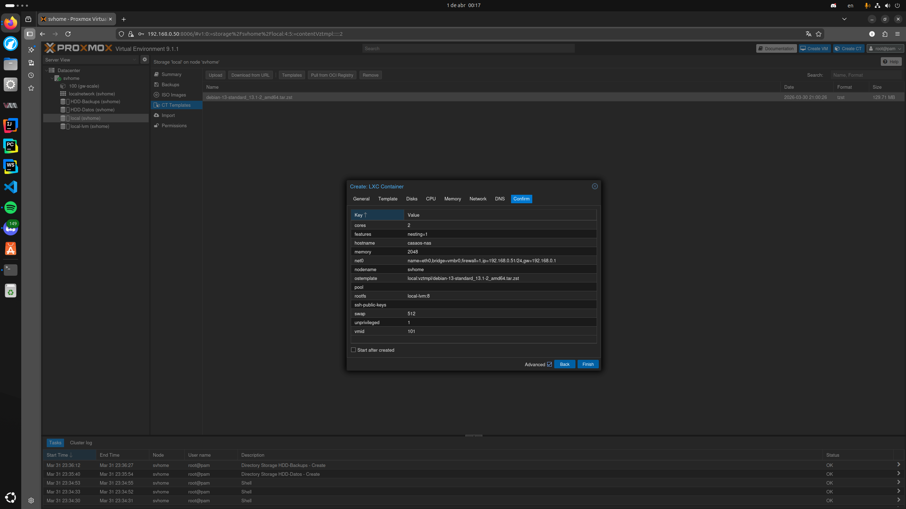
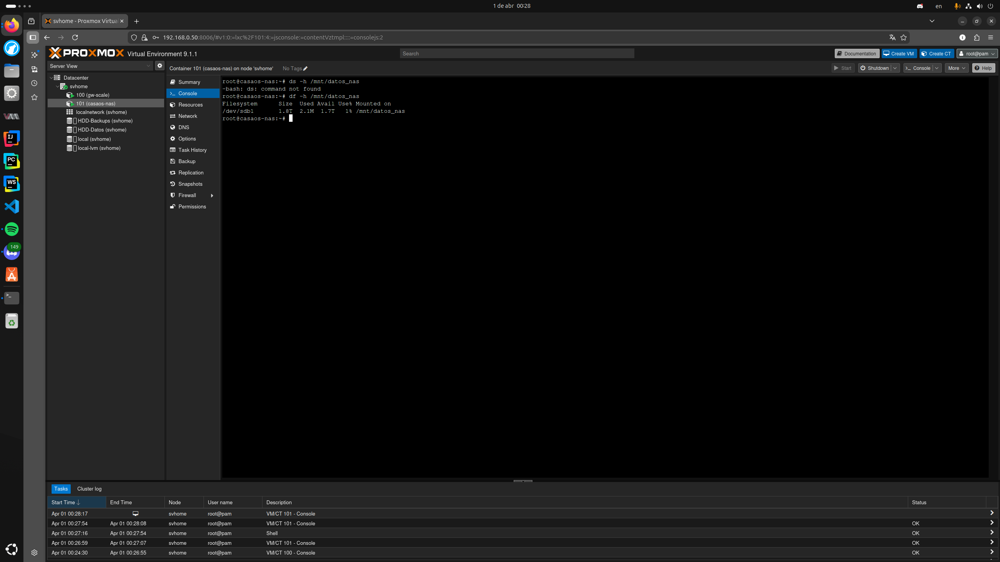
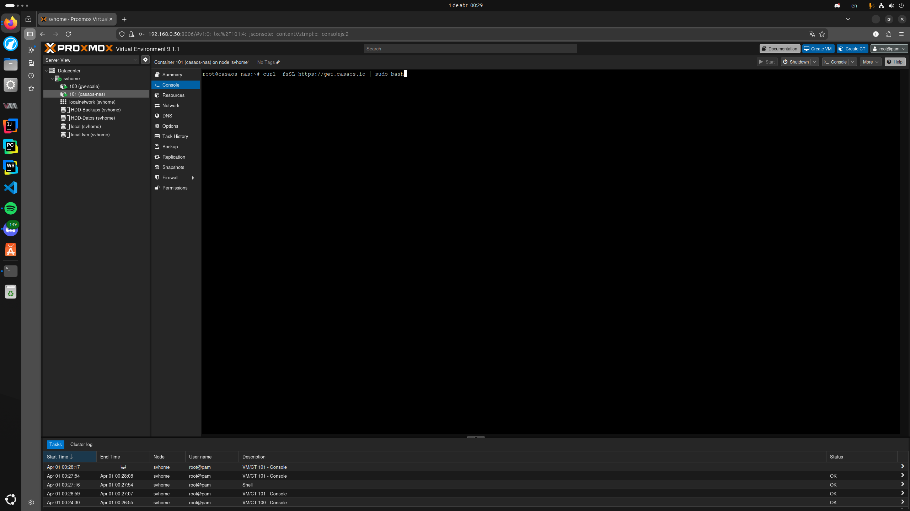
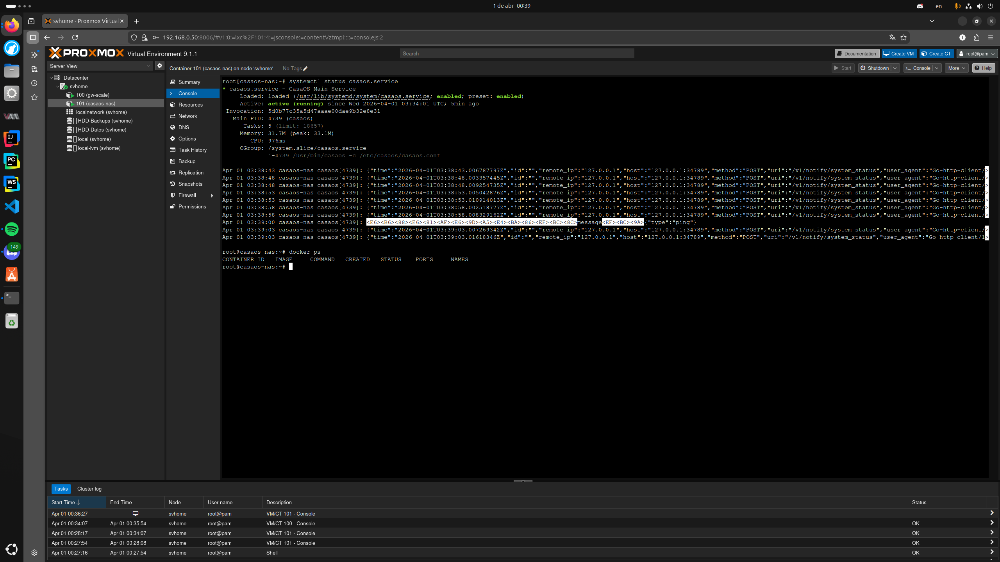
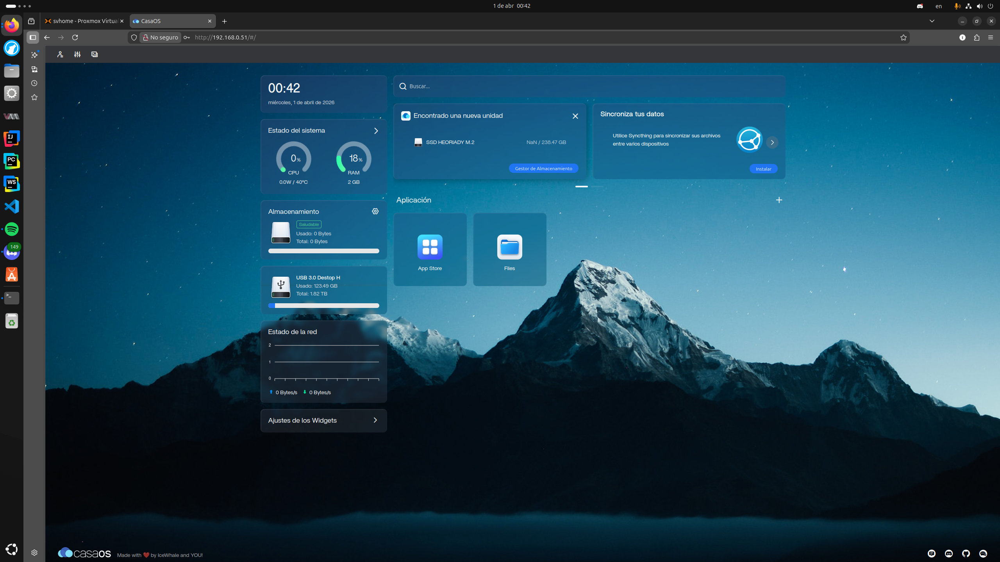

# ☁️ Documentación del Proyecto: Servidor NAS y Nube Personal (CasaOS)

## 🚀 1. Arquitectura de Servicios
Para la gestión de archivos en red (NAS) y el despliegue de microservicios como Immich y Nextcloud, se optó por un entorno **Docker** gestionado gráficamente mediante **CasaOS**. El objetivo es maximizar la eficiencia del Intel i3 mediante el uso de un Contenedor Linux (LXC) sin privilegios.

---

## 🏗️ 2. Creación del Contenedor Base (LXC)
Se aprovisionó un contenedor Debian 12 (Standard) en Proxmox. Se configuraron 2 núcleos de CPU y 2 GB de RAM para asegurar fluidez en el motor de Docker.

---

## 🔗 3. Inyección de Almacenamiento (Bind Mounts)
Para que el contenedor tenga acceso a los 2 TB de almacenamiento mecánico sin pérdida de rendimiento, se realizó un **Bind Mount** desde la shell de Proxmox. Esto permite que CasaOS guarde datos directamente en el disco duro físico.

* **Comando:** `pct set 101 -mp0 /mnt/pve/HDD-Datos,mp=/mnt/datos_nas`
* **Verificación:** El comando `df -h` confirma el montaje del volumen de 1.8 TB.

---

## 💻 4. Instalación del Orquestador (CasaOS)
Se procedió a la instalación automatizada mediante el script oficial. Este proceso configuró el entorno de Docker y levantó los servicios web necesarios para la administración gráfica.

Tras la instalación, se verificó el estado del servicio mediante `systemctl`, confirmando que el motor de CasaOS y Docker están operativos.

---

## 🌐 5. Despliegue del Dashboard
Finalmente, se accedió a la interfaz web para la configuración inicial del administrador. El dashboard reconoce correctamente las unidades de almacenamiento inyectadas, quedando listo para la instalación de aplicaciones.

---

> **✅ Estado Actual:** Servidor NAS operativo con 2 TB de capacidad. Próximos pasos: Configuración de SMB para red local y despliegue de Immich.
