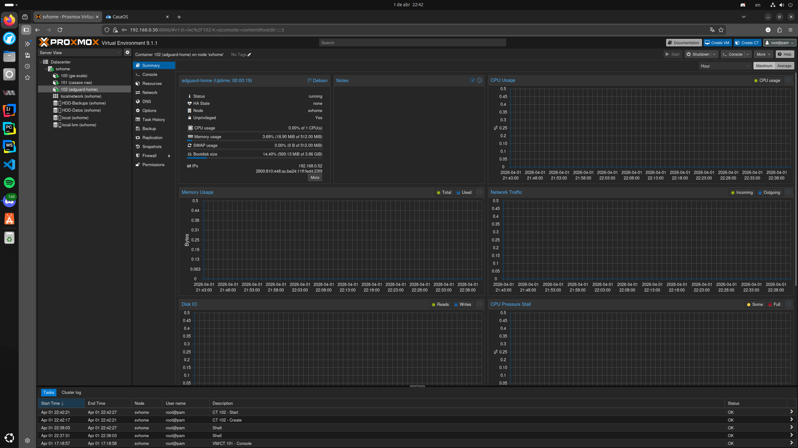
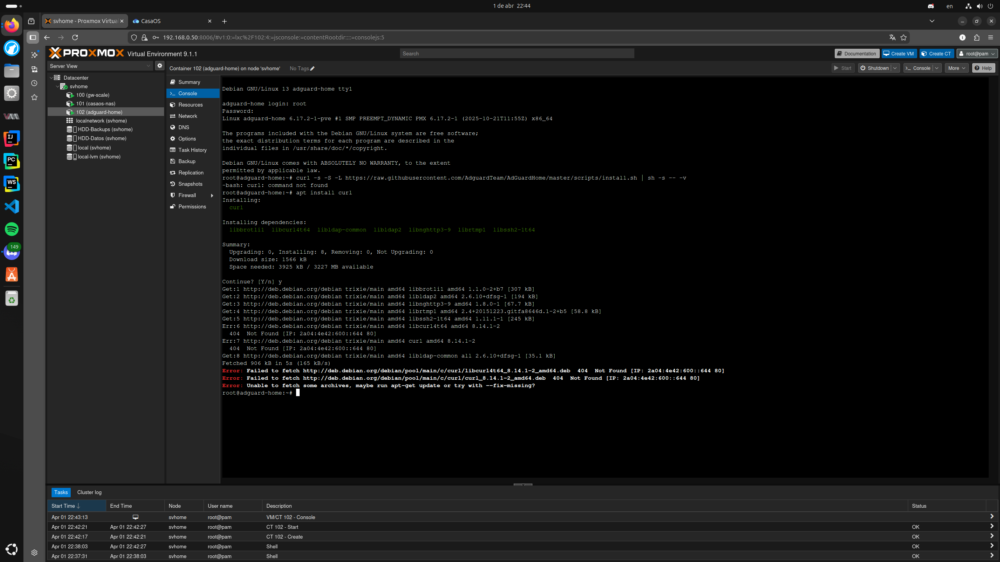
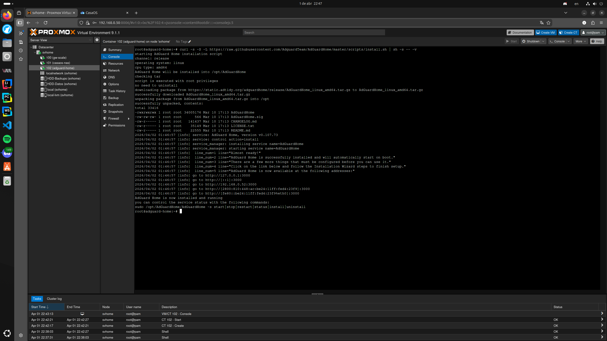
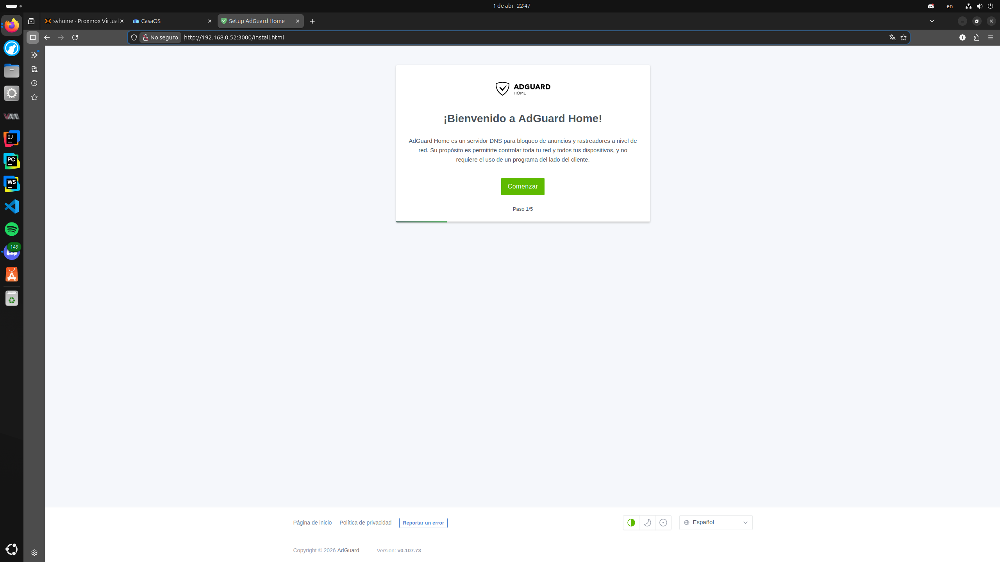
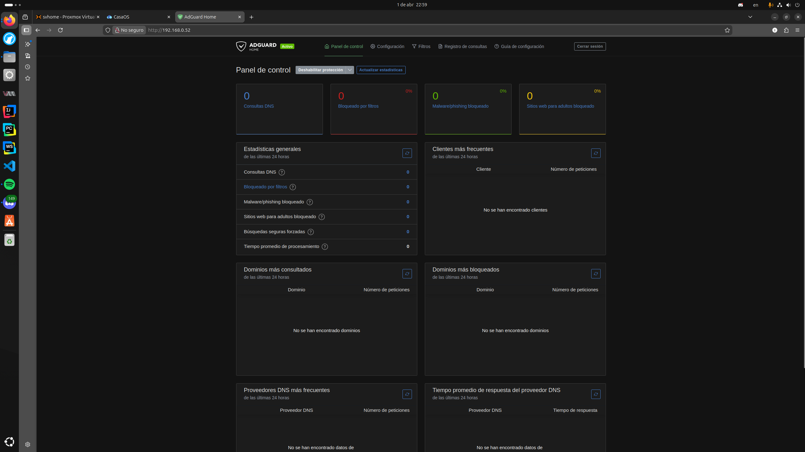
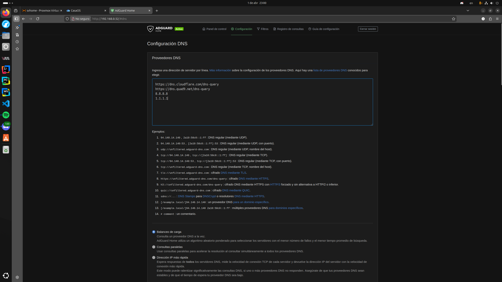
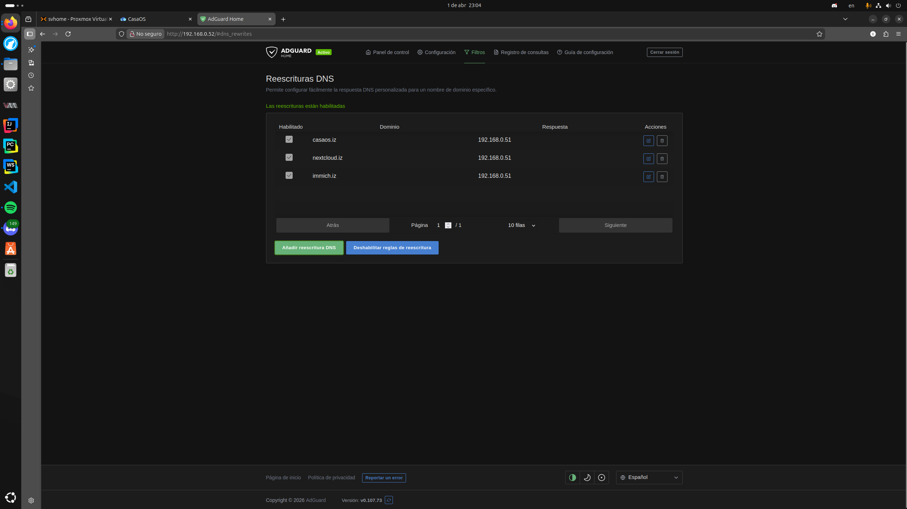
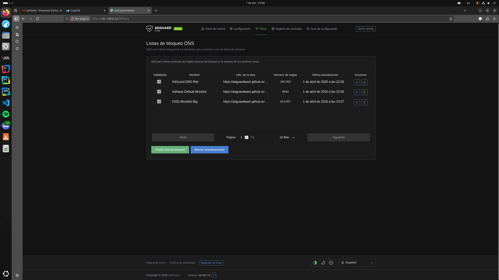
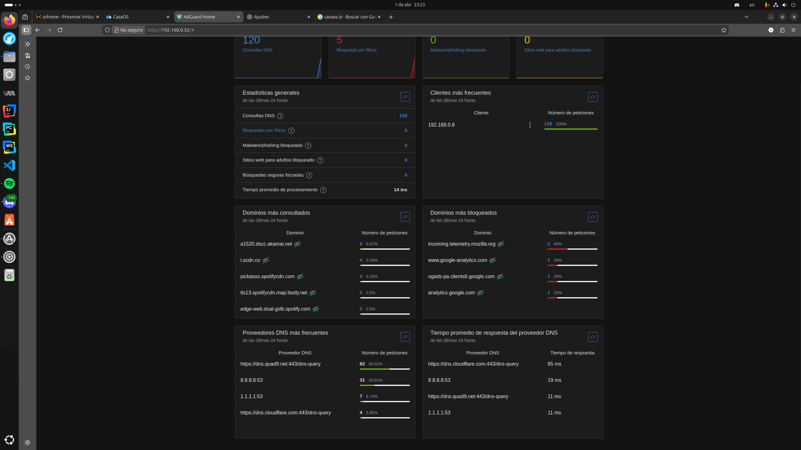
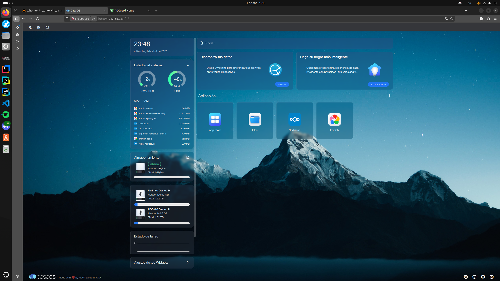

# 07 - Servidor DNS AdGuard Home: Bloqueo de Publicidad y DNS Local

Este módulo documenta la implementación y configuración de un servidor DNS dedicado (LXC 102) en el nodo `svhome`. El objetivo es centralizar el filtrado de anuncios para toda la red de Lanús y habilitar la resolución de nombres locales (`.iz`) para los servicios del clúster.

---

## 1. Despliegue del Contenedor (LXC 102)

Se optó por un contenedor independiente para asegurar que la resolución de nombres no dependa del estado de los servidores de aplicaciones (CasaOS).

* **Hostname:** `adguard-home`
* **SO:** Debian 12 (Plantilla Trixie/Sid)
* **Recursos:** 1 vCPU / 512MB RAM / 8GB Disco
* **Red:** IP Estática `192.168.0.52/24`



---

## 2. Resolución de Problemas de Instalación

### 2.1. Error de Repositorios (404 Not Found)

Al intentar instalar `curl` en la plantilla limpia de Debian, el gestor `apt` falló debido a que las listas estaban desincronizadas con los servidores espejo.



**Solución aplicada:**
Se forzó la actualización de los índices de paquetes para corregir los punteros de descarga:

```bash
apt update && apt install curl -y
```

### 2.2. Script de Instalación Oficial

Con el stack de red operativo, se procedió a la descarga y ejecución del binario de AdGuard Home:

```bash
curl -s -S -L https://raw.githubusercontent.com/AdguardTeam/AdGuardHome/master/scripts/install.sh | sh -s -- -v
```



---

## 3. Configuración del Servicio Web

### 3.1. Asistente de Configuración

Se accedió a la interfaz de pre-configuración vía `http://192.168.0.52:3000`. Se definió el puerto 80 para la interfaz web y el puerto 53 para el tráfico DNS.



### 3.2. Panel de Control (Dashboard)

Una vez finalizado el asistente, se validó el acceso al dashboard principal donde se monitorean las consultas en tiempo real.



### 3.3. Configuración de Upstream DNS

Para asegurar privacidad y velocidad, se configuraron proveedores DNS con soporte cifrado (DNS over HTTPS):

* `https://dns.cloudflare.com/dns-query`
* `https://dns.quad9.net/dns-query`
* `8.8.8.8` (Como servidor de respaldo)



---

## 4. Gestión de Nombres Locales y Filtrado

### 4.1. DNS Rewrites (Dominios .iz)

Se crearon registros de reescritura para mapear los servicios a nombres mnemotécnicos. Esto permite acceder a las herramientas sin recordar direccionamiento IP estático.

* `casaos.iz` -> `192.168.0.51`
* `nextcloud.iz` -> `192.168.0.51`
* `immich.iz` -> `192.168.0.51`



### 4.2. Listas de Bloqueo

Se activaron filtros de alta fidelidad para proteger la privacidad de los dispositivos de la red:

* AdGuard DNS filter
* AdAway Default Blocklist
* OISD Blocklist Big (Balance óptimo entre bloqueo y estabilidad)



---

## 5. Configuración del Cliente y Validación

### 5.1. Ajustes en Linux (la-maleducada)

Para que el sistema operativo utilice el nuevo servidor, se configuró la prioridad DNS mediante `systemd-resolved`. Además, fue necesario desactivar el "DNS sobre HTTPS" en Firefox, ya que el navegador ignoraba la configuración del sistema para usar Cloudflare de forma nativa.

```bash
# Forzar el DNS local en la interfaz física
sudo resolvectl dns enp7s0 192.168.0.52
sudo resolvectl flush-caches
```

### 5.2. Verificación en Logs

Se confirmó en el registro de consultas que las peticiones al dominio local `casaos.iz` son interceptadas y resueltas correctamente por el servidor en milisegundos.



---

## 6. Resultado Final

Se validó el acceso exitoso a la infraestructura utilizando el nombre de dominio personalizado. El sistema ahora filtra publicidad a nivel de red y resuelve servicios internos de manera transparente.


