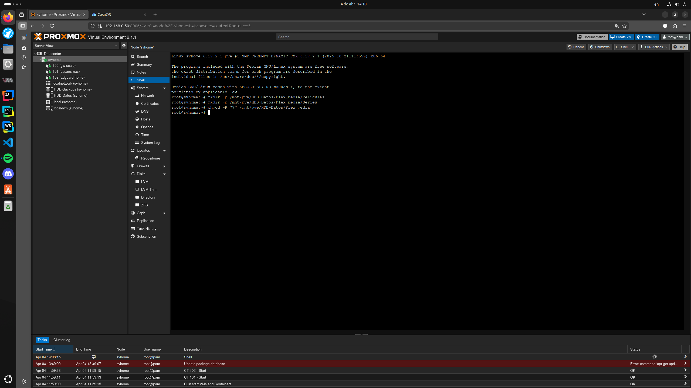
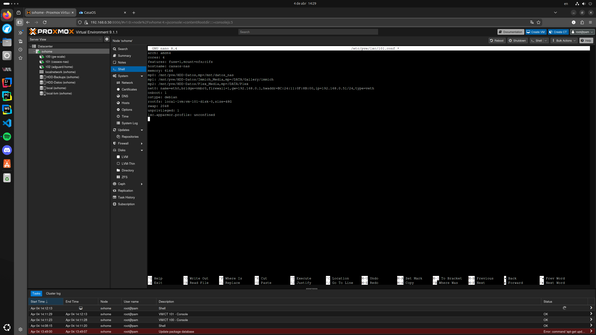
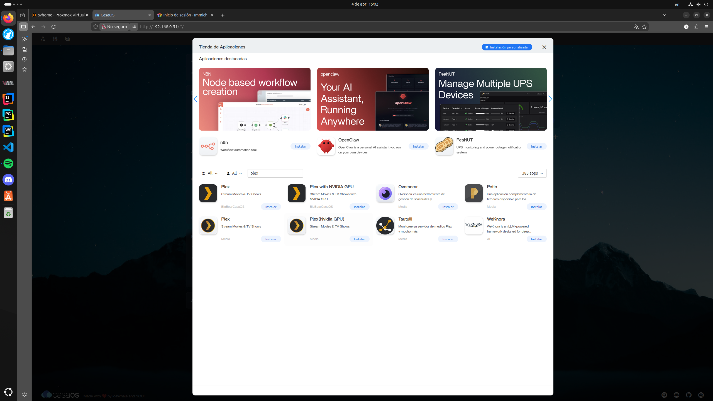
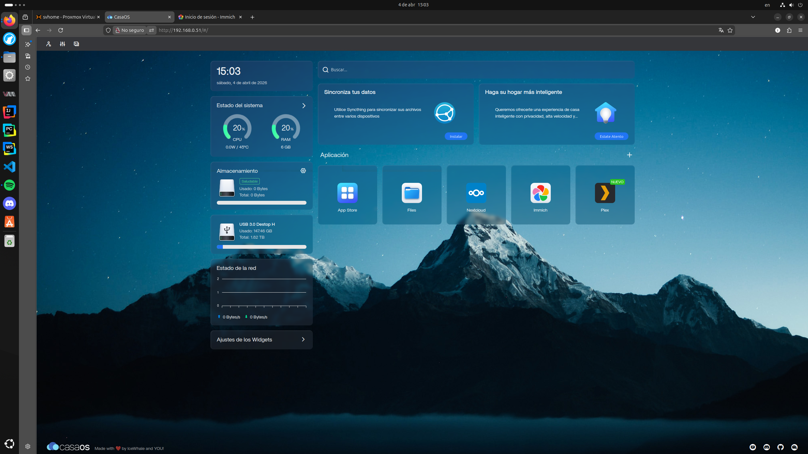
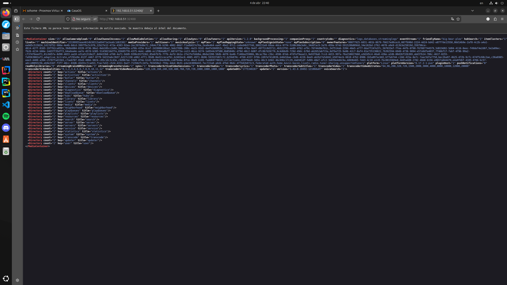
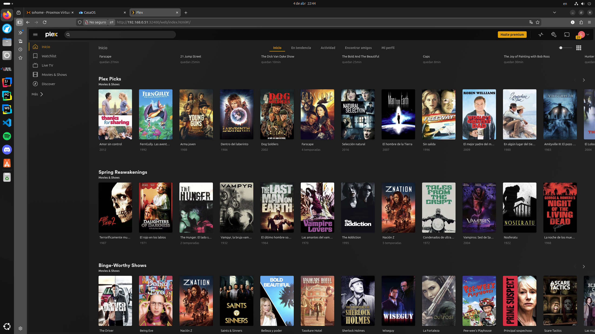

# Guía de Instalación: Servidor Plex en Proxmox

Esta guía documenta el proceso paso a paso para desplegar un servidor multimedia Plex nativo utilizando un hipervisor Proxmox, un contenedor LXC corriendo CasaOS, y mapeo de almacenamiento en un disco duro externo.

## 🏗️ Arquitectura
* **Hipervisor:** Proxmox VE
* **OS del Contenedor (LXC):** Debian (Privilegiado/Unprivileged)
* **Gestor de Docker:** CasaOS
* **Almacenamiento:** HDD Externo montado en Proxmox (`/mnt/pve/HDD-Datos`)

---

## 🚀 Paso 1: Preparación del Almacenamiento (Proxmox)

Primero, necesitamos crear la estructura de carpetas en el disco duro físico y asignar los permisos correspondientes para que los contenedores puedan leer y escribir sin problemas.

Desde la consola principal del nodo de Proxmox (Host), ejecutamos:

```bash
# Crear directorio principal y subdirectorios para bibliotecas
mkdir -p /mnt/pve/HDD-Datos/Plex_media/Peliculas
mkdir -p /mnt/pve/HDD-Datos/Plex_media/Series

# Asignar permisos amplios para evitar conflictos con el usuario de Docker (UID 1000)
chmod -R 777 /mnt/pve/HDD-Datos/Plex_media
```



## 🔌 Paso 2: Mapeo del Volumen al Contenedor LXC

Para que CasaOS (que corre dentro de un LXC) pueda ver el disco físico, debemos crear un "Mount Point" (Punto de montaje) en la configuración del contenedor.

1. Abrir el archivo de configuración del contenedor (reemplazar `101` por el ID correspondiente):

```bash
nano /etc/pve/lxc/101.conf
```

2. Agregar la siguiente línea al final del archivo para enlazar la ruta del Host con la ruta interna del LXC:

```text
mp2: /mnt/pve/HDD-Datos/Plex_media,mp=/DATA/Plex
```



3. Guardar los cambios y reiniciar el contenedor para aplicar el montaje.

## 📦 Paso 3: Instalación de Plex (CasaOS)

Con el almacenamiento listo, pasamos a la interfaz gráfica de CasaOS.

1. Abrir la **App Store** integrada en CasaOS.
2. Buscar **Plex** y seleccionar la versión estándar (evitar la versión "NVIDIA GPU" a menos que el servidor cuente con una tarjeta gráfica dedicada).



3. Hacer clic en **Instalar**. *Nota: No abrir la aplicación inmediatamente después de instalar.*



## ⚙️ Paso 4: Configuración de Volúmenes en Docker

Antes de iniciar Plex, hay que indicarle al contenedor de Docker dónde buscar los archivos multimedia, conectando las rutas de CasaOS con las de Plex.

1. En el dashboard de CasaOS, hacer clic en los tres puntos (`...`) sobre el ícono de Plex y seleccionar **Settings (Ajustes)**.
2. En la sección **Volumes (Volúmenes)**, configurar las siguientes rutas:
   * **Host:** `/DATA/Plex/Peliculas` ➡️ **Container:** `/movies`
   * **Host:** `/DATA/Plex/Series` ➡️ **Container:** `/tv`
3. Guardar los cambios. El contenedor se reiniciará automáticamente.

## 🌐 Paso 5: Acceso y Configuración Inicial

1. Acceder a la interfaz web de Plex a través del navegador. 
   * ⚠️ **Importante:** Si al ingresar al puerto `32400` se muestra un código XML en bruto, es necesario agregar `/web` al final de la URL.



2. La URL final correcta debe quedar así:

```text
http://<IP-DEL-SERVIDOR>:32400/web
```

3. Iniciar sesión con una cuenta de Plex y seguir el asistente de inicio para reclamar el servidor. *(Nota: Es necesario estar en la misma red local LAN para este paso; deshabilitar VPNs temporalmente).*
4. **Agregar Bibliotecas:**
   * Crear biblioteca "Películas" y apuntar a la carpeta interna `/movies`.
   * Crear biblioteca "Series" y apuntar a la carpeta interna `/tv`.



## 📂 Paso 6: Subir Contenido Multimedia

Una vez que el servidor está corriendo, existen varias formas de transferir películas y series al disco del servidor para que Plex las detecte.

### Método A: A través de CasaOS (Interfaz Web)
Ideal para subir archivos individuales de forma rápida.
1. Ingresar al panel de **CasaOS**.
2. Abrir la aplicación **Files** (Archivos).
3. Navegar hasta la ruta: `DATA` ➡️ `Plex` ➡️ `Peliculas` (o `Series`).
4. Arrastrar y soltar el archivo `.mp4` o `.mkv` desde la computadora local hacia la ventana del navegador.

### Método B: Carpeta Compartida en Red (SMB)
La opción recomendada para gestionar grandes volúmenes de datos.
1. En la app **Files** de CasaOS, ubicar la carpeta `Plex` (dentro de `DATA`).
2. Hacer clic en los tres puntos de la carpeta y seleccionar **Share** (Compartir).
3. En el Explorador de Archivos de Windows (o el gestor de Linux/Mac), escribir la dirección IP del servidor en la barra de rutas:
   * Windows: `\\<IP-DEL-SERVIDOR>`
   * Linux/Mac: `smb://<IP-DEL-SERVIDOR>`
4. Copiar y pegar los archivos directamente a través de la red local.

### Método C: Vía Terminal (SCP)
Para transferencias seguras desde otra consola Linux/Mac utilizando SSH.
```bash
# Ejemplo para copiar una película desde la PC local al contenedor LXC
scp "/ruta/local/Pelicula (2024).mkv" root@<IP-DEL-SERVIDOR>:/DATA/Plex/Peliculas/
```
