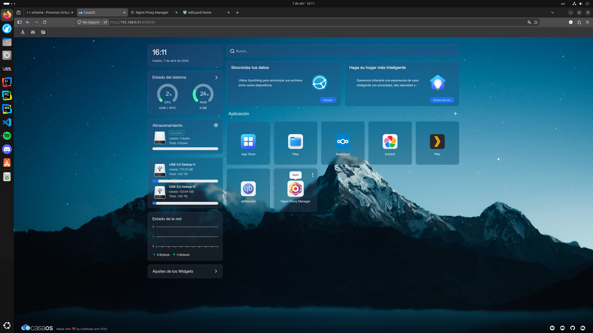
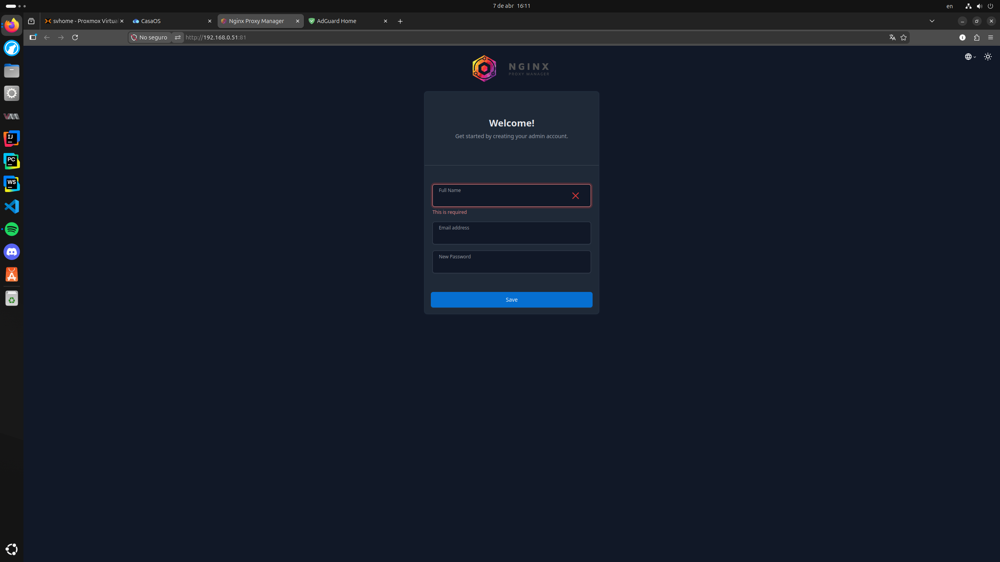
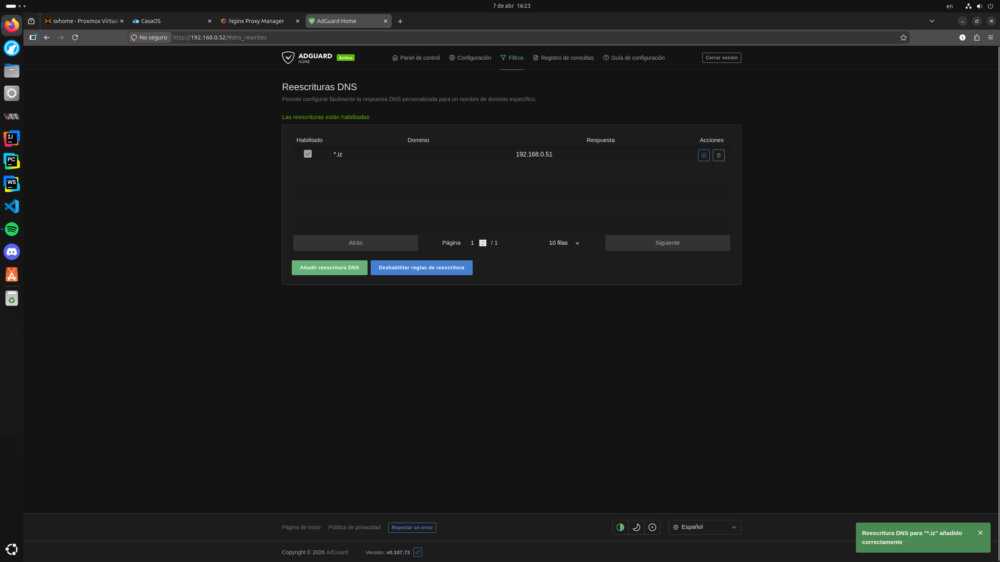
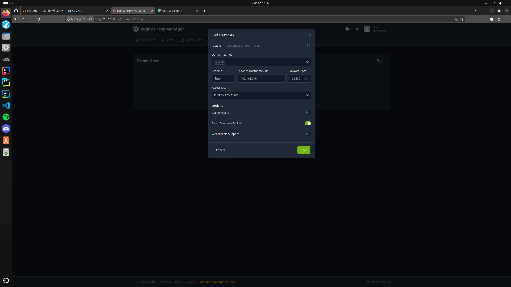
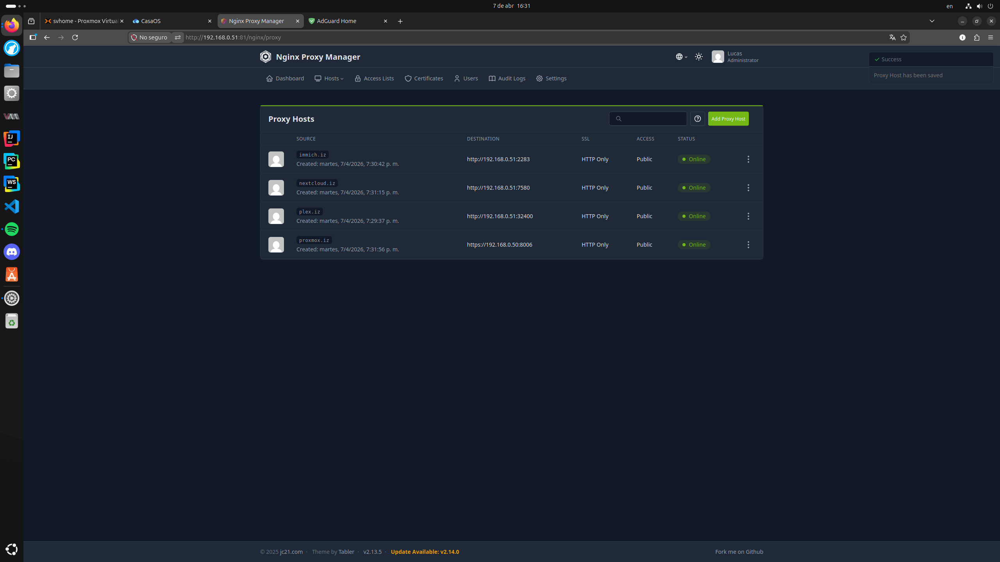
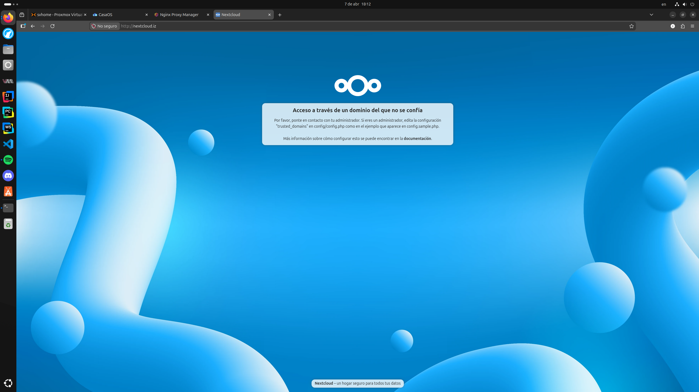
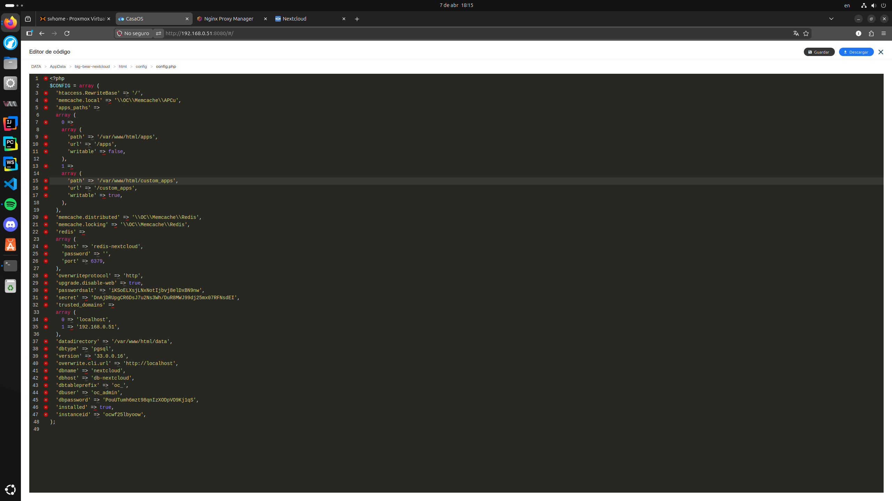

# 09-Nginx.md

## Configuración de Proxy Inverso y DNS Local en el HomeLab

Este documento detalla la implementación de **Nginx Proxy Manager (NPM)** y la configuración del dominio local personalizado **`.iz`**. Esta arquitectura permite centralizar el acceso a todos los servicios (Plex, Immich, Nextcloud y Proxmox) de forma profesional y segura.

---

### 1. Resolución de Conflictos de Puertos
Para que Nginx sea el punto de entrada principal, debe utilizar el puerto **80**. Se procedió a desplazar la interfaz web de **CasaOS** para liberar dicho puerto.

* **Acción:** Cambio de "Web UI Port" en los ajustes de CasaOS de `80` a `8080`.
* **Imagen de referencia:** 

### 2. Instalación de Nginx Proxy Manager (NPM)
Instalación realizada a través de la App Store de CasaOS con configuración manual de puertos.

* **Puertos mapeados:**
    * HTTP: `80:80`
    * HTTPS: `443:443`
    * Admin Panel: `81:81`
* **Imagen de referencia:** 

### 3. Configuración del DNS Local (AdGuard Home)
Para resolver los nombres `.iz` sin salir a internet, se configuró el contenedor LXC de AdGuard Home (`192.168.0.52`).

* **Configuración:** Se añadió una reescritura DNS (DNS Rewrite) para el wildcard `*.iz` apuntando a la IP de CasaOS (`192.168.0.51`).
* **Imagen de referencia:** 

### 4. Administración de Proxy Hosts
Se configuraron los túneles internos para redirigir el tráfico basado en el nombre de dominio.

| Servicio | Dominio | IP Destino | Puerto | Esquema |
| :--- | :--- | :--- | :--- | :--- |
| **Plex** | `plex.iz` | `192.168.0.51` | `32400` | http |
| **Immich** | `immich.iz` | `192.168.0.51` | `2283` | http |
| **Nextcloud** | `nextcloud.iz` | `192.168.0.51` | `7580` | http |
| **Proxmox** | `proxmox.iz` | `192.168.0.50` | `8006` | https |

* **Imágenes de referencia:**  y 

### 5. Configuración del Cliente (Ubuntu Desktop)
Para que el sistema operativo respete la jerarquía de DNS local:

1.  Se desactivó el DNS automático en la configuración de red IPv4.
2.  Se estableció como único servidor DNS la IP de AdGuard: `192.168.0.52`.
3.  Se configuró el modo "Automático (DHCP) solo direcciones".
4.  Se desactivó **DNS sobre HTTPS (DoH)** en Firefox.

### 6. Resolución de "Trusted Domains" en Nextcloud
Al acceder mediante un dominio personalizado, Nextcloud bloquea la conexión por seguridad. Se realizó la edición manual del archivo de configuración.

* **Ruta del archivo:** `/AppData/Nextcloud/html/config/config.php`
* **Modificación:** Se agregó `'nextcloud.iz'` al array de `trusted_domains`.
* **Imagen de referencia (Error):** 
* **Imagen de referencia (Solución):** 

---

## Resultados
* **Acceso simplificado:** Los servicios ya no requieren recordar puertos (ej. `http://plex.iz/web`).
* **Privacidad:** Todo el tráfico de resolución de nombres permanece dentro de la red local de Lanús.
* **Escalabilidad:** Se pueden añadir nuevos servicios simplemente creando un nuevo Proxy Host en NPM.
