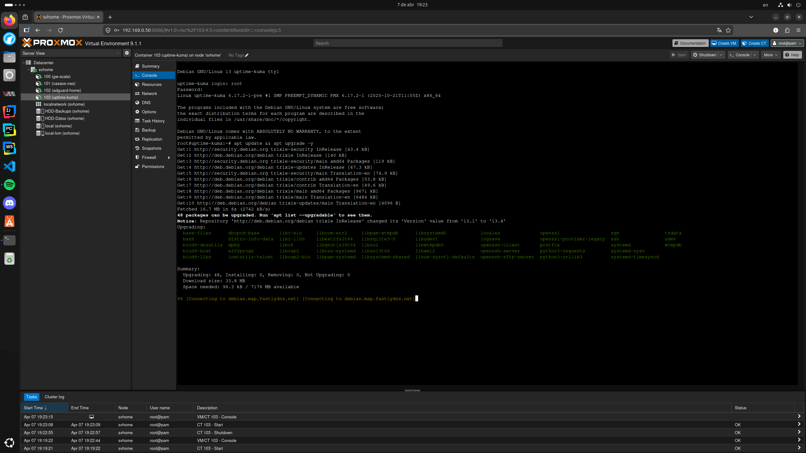
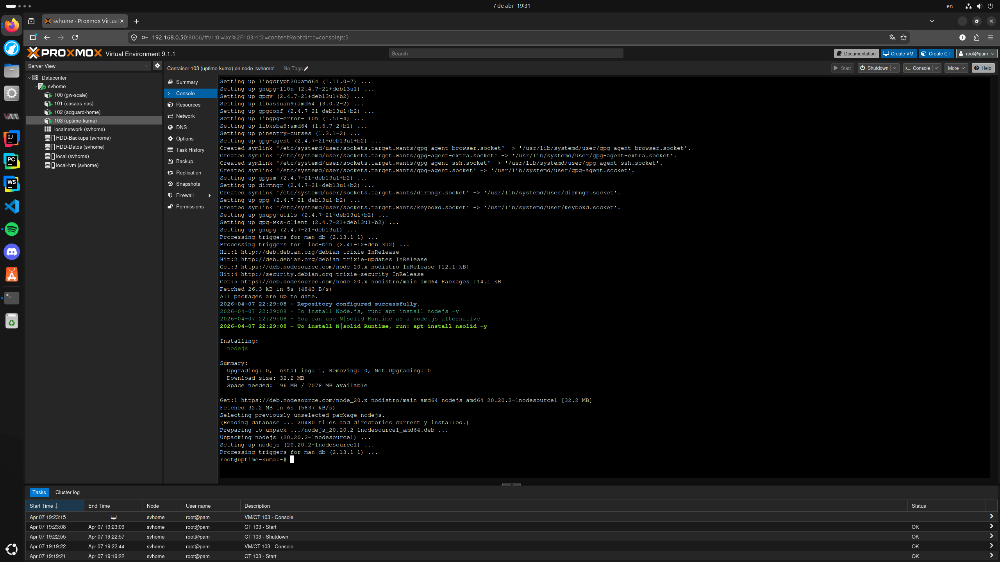
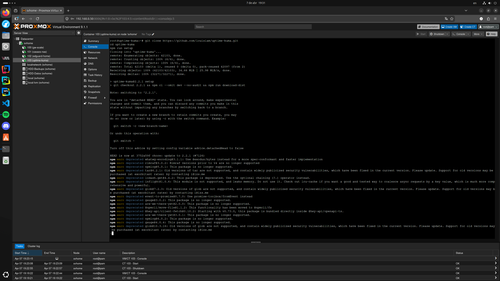
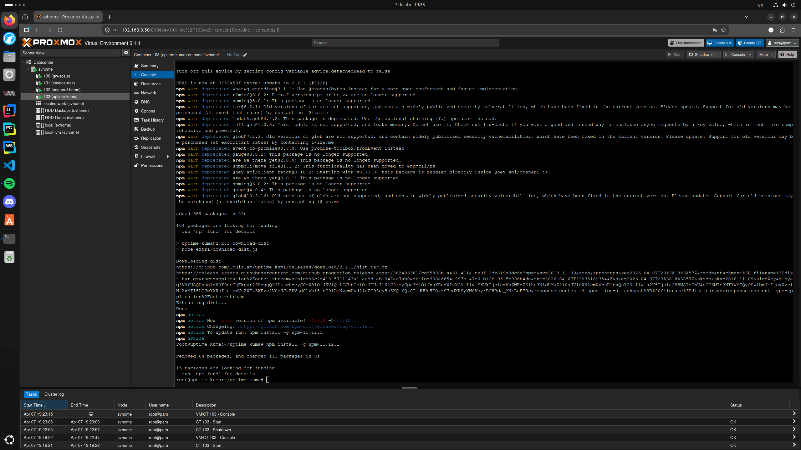
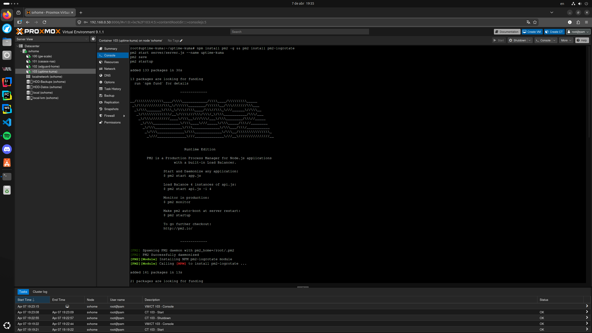
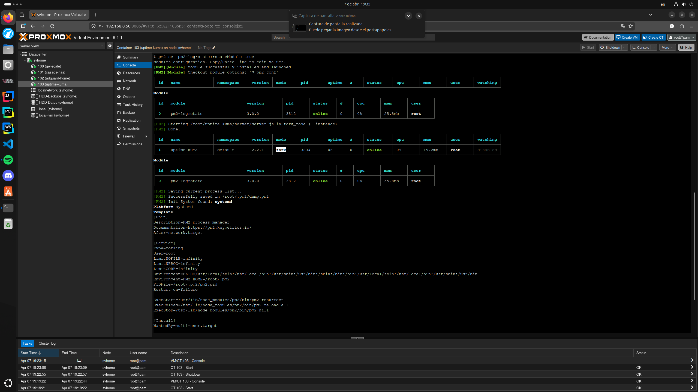
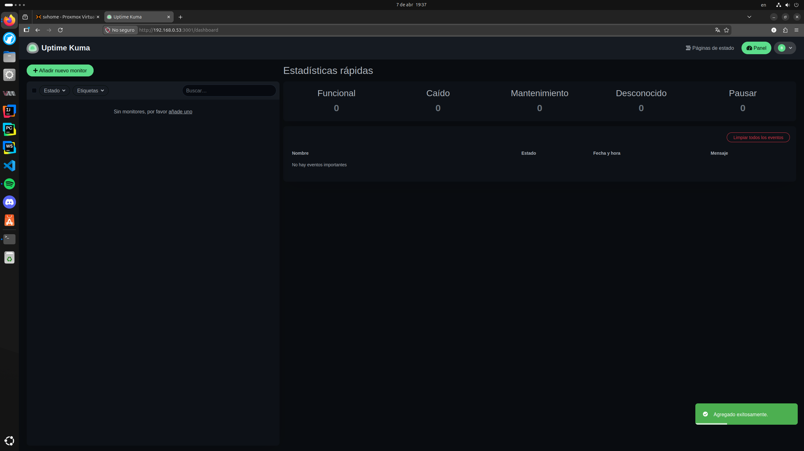
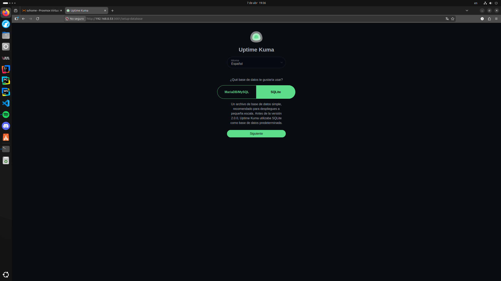
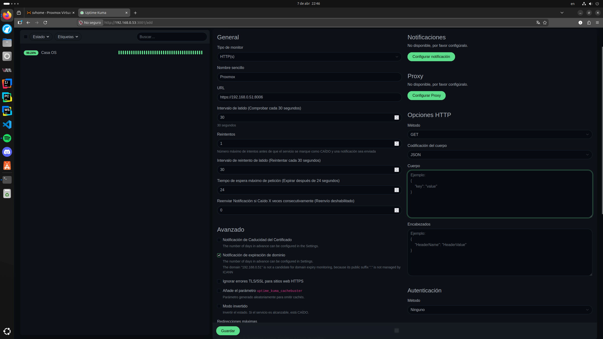
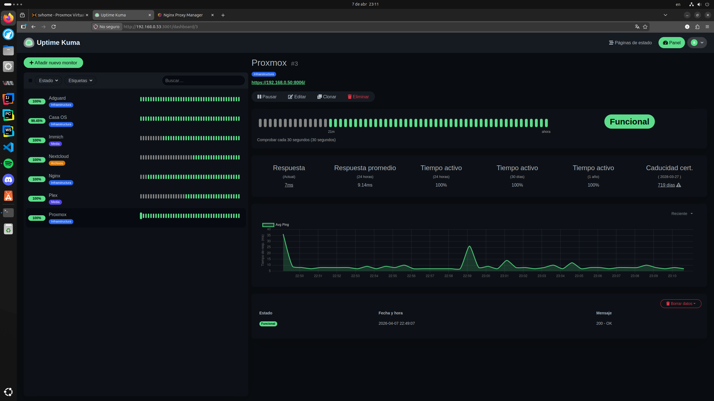

# 10 - Monitoreo de Servicios (Uptime Kuma)

## 1. Descripción General
Uptime Kuma es el centro de monitoreo proactivo del laboratorio. Su función es vigilar la disponibilidad de los servicios, medir latencias y notificar vía Telegram ante cualquier incidencia, garantizando que la infraestructura que soporta proyectos como Mabu esté siempre operativa.

## 2. Especificaciones de Infraestructura
* **Hipervisor:** Proxmox VE (svhome)
* **Tipo:** Contenedor LXC (ID 103)
* **Sistema Operativo:** Debian 12
* **IP Local:** 192.168.0.53
* **Puerto:** 3001
* **Acceso Local:** http://kuma.iz (vía Nginx Proxy Manager)

---

## 3. Proceso de Instalación Completo (Consola LXC)
Se realizó la instalación nativa para optimizar el consumo de recursos en el servidor. A continuación, se detallan los comandos ejecutados en la terminal del contenedor.

### Paso 1: Preparación y Dependencias
Actualización del índice de paquetes e instalación de herramientas básicas como `curl` y `git`.

    apt update && apt upgrade -y
    apt install -y curl git

### Paso 2: Instalación de Node.js (v20 LTS)
Configuración del repositorio oficial de NodeSource e instalación del entorno de ejecución Node.js necesario para Kuma.

    curl -fsSL https://deb.nodesource.com/setup_20.x | bash -
    apt install -y nodejs

### Paso 3: Clonación y Setup de Uptime Kuma
Descarga del código fuente desde GitHub y ejecución del script de configuración inicial.

    git clone https://github.com/louislam/uptime-kuma.git
    cd uptime-kuma
    npm run setup

### Paso 4: Persistencia con PM2 (Gestor de Procesos)
Instalación de PM2 para asegurar que el servicio inicie automáticamente con el contenedor y se recupere ante fallos imprevistos.

    npm install pm2 -g
    pm2 install pm2-logrotate
    pm2 start server/server.js --name uptime-kuma
    pm2 save
    pm2 startup

---

## 4. Configuración Inicial e Interfaz Web

Al acceder por primera vez a la interfaz web (puerto 3001), se procedió a la creación de la base de datos y la cuenta de administrador.

### Selección de Base de Datos
Se seleccionó **SQLite** como motor de base de datos para mantener el contenedor ligero y evitar dependencias de servidores de bases de datos externos.

---

## 5. Matriz de Monitores y Servicios

Se configuraron los servicios críticos con un intervalo de 60s y un margen de **2 reintentos** para evitar falsas alarmas por micro-cortes de red. El tablero final muestra todos los servicios operativos (Up).

| Servicio | Protocolo | URL / IP | Configuración Especial |
| :--- | :--- | :--- | :--- |
| **Proxmox** | HTTPS | https://192.168.0.50:8006 | Ignorar errores TLS/SSL (Cert. Auto-firmado) |
| **AdGuard** | HTTP | http://192.168.0.52 | Monitor de DNS Local |
| **Nginx** | HTTP | http://192.168.0.51:81 | Panel de Control de Proxy |
| **CasaOS** | HTTP | http://192.168.0.51:8080 | Panel de Gestión |
| **Plex** | HTTP | http://192.168.0.51:32400/web | Path obligatorio `/web` |
| **Immich** | HTTP | http://192.168.0.51:2283 | Backup de fotos |
| **Nextcloud** | HTTP | http://192.168.0.51:7580 | Almacenamiento nube |

---

## 6. Resolución de Problemas (Troubleshooting)

Durante la puesta en marcha, se identificaron y resolvieron los siguientes incidentes técnicos.

### A. Error de Protocolo SSL (CasaOS)
* **Incidencia:** El monitor de CasaOS fallaba indicando un error de versión de SSL (Wrong version number).
* **Solución:** Se corrigió la URL cambiando el protocolo de `https` a `http`, ya que el servicio corre de forma nativa sin cifrado en ese puerto específico.

### B. Error 401 / Down (Plex)
* **Incidencia:** Plex marcaba estado caído ("Down") al apuntar solo a la IP:Puerto, devolviendo un error de autenticación.
* **Solución:** Se agregó `/web` al final de la URL para que el servidor responda correctamente con la interfaz web y un código 200 OK.

### C. Advertencia de Certificado (Proxmox)
* **Observación:** Kuma detecta correctamente el certificado auto-firmado de Proxmox e indica su caducidad (ej: 719 días).
* **Acción:** Se habilitó la opción "Ignore TLS/SSL Error" en los ajustes avanzados del monitor para permitir el monitoreo del hipervisor.

---

## 7. Notificaciones (Telegram Bot)

Se integró un bot de Telegram para recibir alertas instantáneas en el dispositivo móvil del administrador ante cualquier cambio de estado.

* **Método:** Conexión vía API Token proporcionado por BotFather y Chat ID personal.
* **Resultado:** Prueba de notificación exitosa recibida en el celular.

---

## 8. Acceso Remoto y Red

* **Nginx Proxy Manager:** Se configuró un Proxy Host para el dominio local `kuma.iz` apuntando a la IP `.53` en el puerto `3001`.
* **VPN:** El servicio es accesible de forma segura desde el exterior mediante la red de **Tailscale**, utilizando el Gateway configurado en el servidor para enrutar el tráfico local.

---
**Estado Final:** Sistema de monitoreo 100% funcional, alertando y documentado con éxito.
