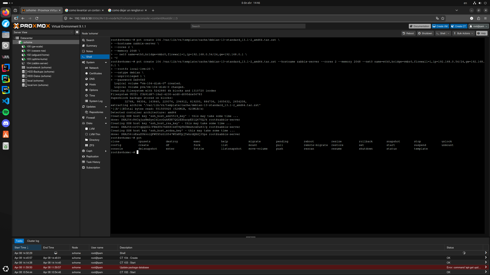
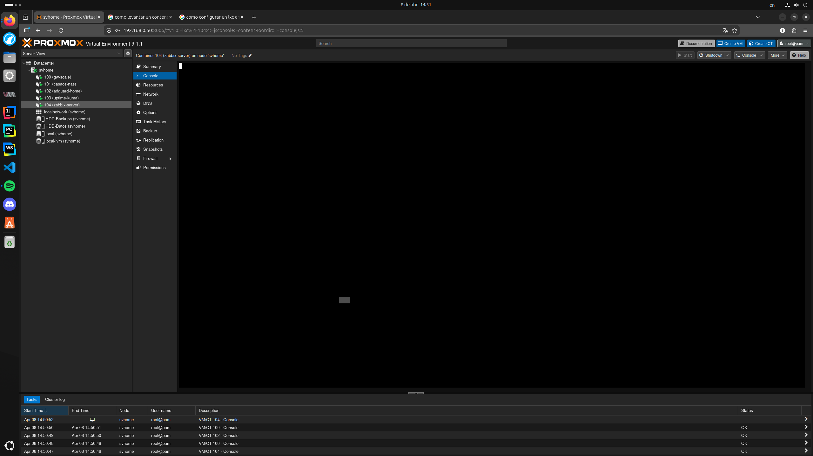
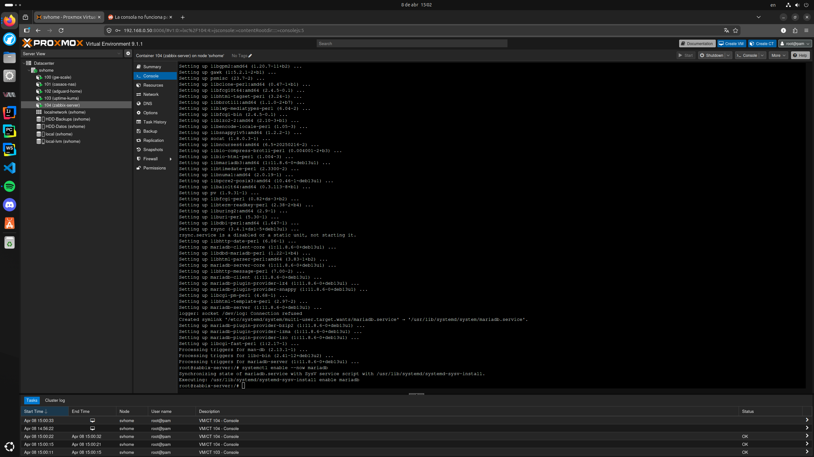
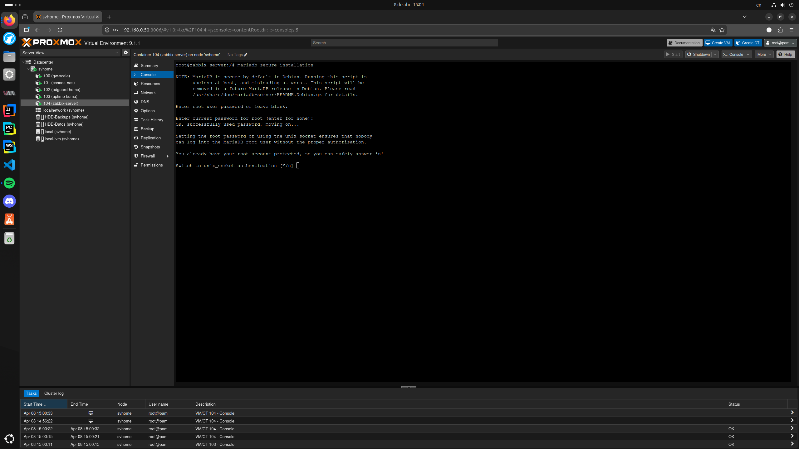
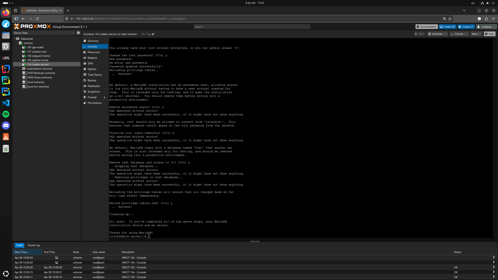
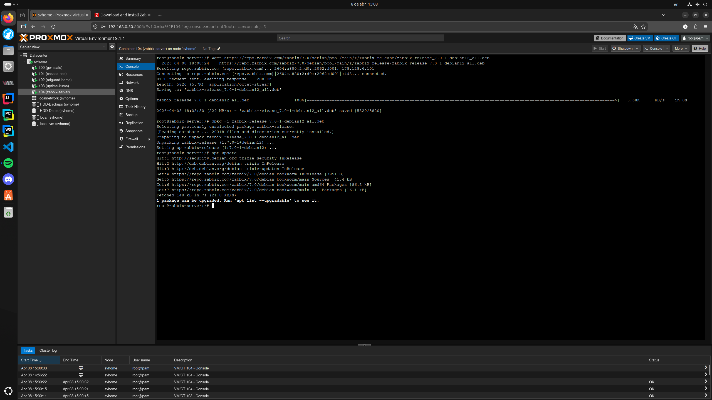
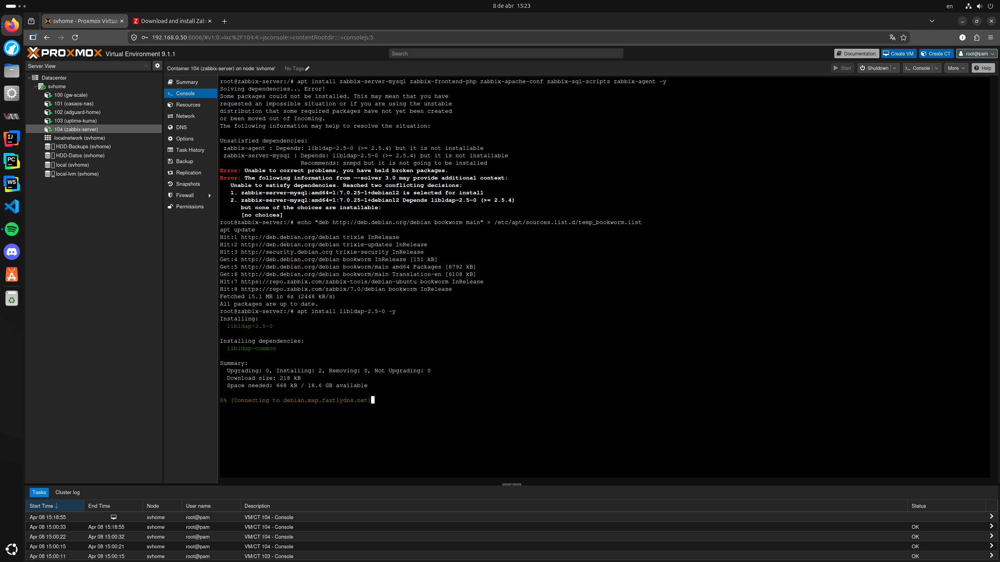
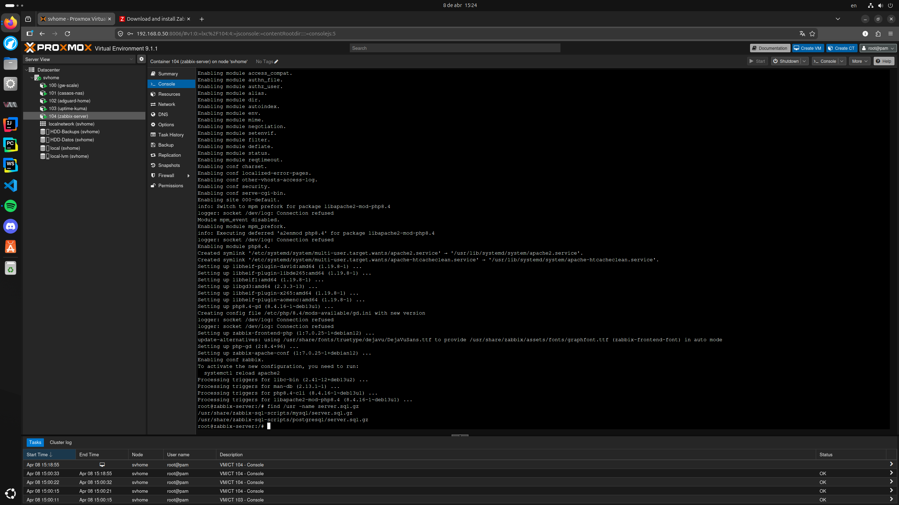
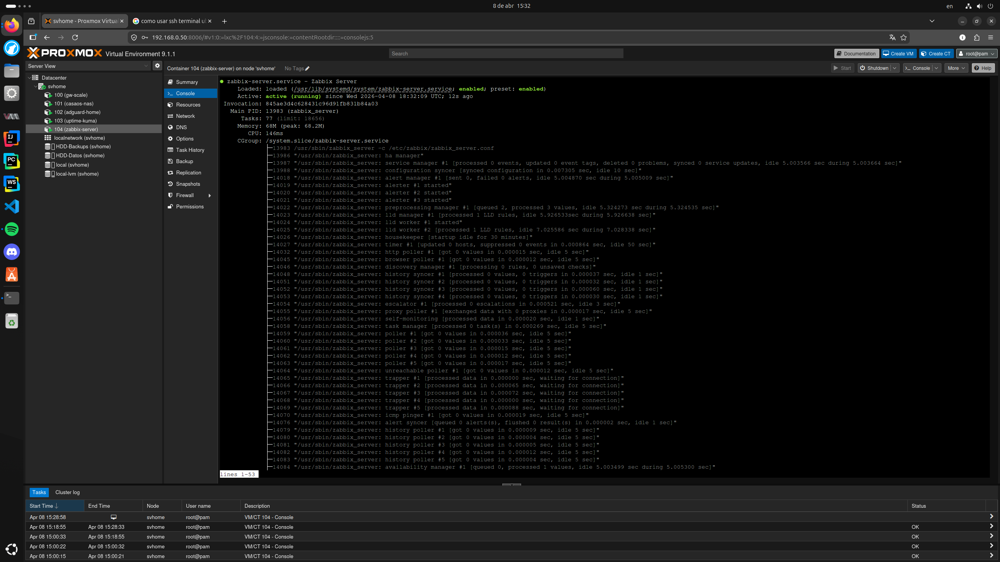
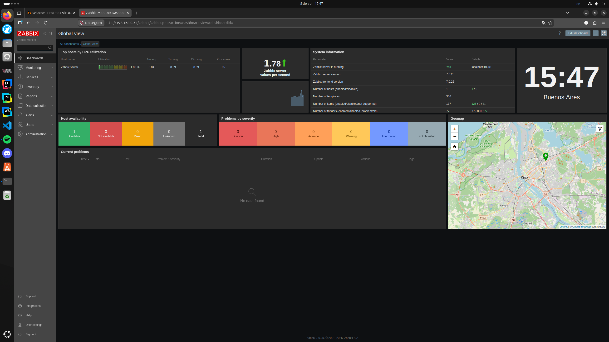

# 11 - Sistema de Monitoreo (Zabbix Server)

## 1. Descripción General
Zabbix es el "cerebro" de monitoreo de grado empresarial del laboratorio. Su función es recopilar métricas avanzadas, analizar el rendimiento de la infraestructura y almacenar datos históricos de los contenedores y el hipervisor para asegurar la salud de los servicios como Mabu.

## 2. Especificaciones de Infraestructura
* **Hipervisor:** Proxmox VE (svhome)
* **Tipo:** Contenedor LXC (ID 104)
* **Sistema Operativo:** Debian 13 (Trixie)
* **IP Local:** 192.168.0.54
* **Puerto:** 80 (HTTP)
* **Acceso Local:** [http://192.168.0.54/zabbix](http://192.168.0.54/zabbix)

---

## 3. Proceso de Instalación Completo (Consola LXC)
Debido a que Debian 13 es una versión Testing, la instalación requirió parches de compatibilidad y ajustes de dependencias. A continuación, se detallan los comandos ejecutados en la terminal.

### Paso 1: Creación del Contenedor (CLI de Proxmox)
Se optó por la creación vía línea de comandos en el nodo svhome para asegurar la correcta asignación de red y evitar limitaciones de la interfaz gráfica.

    pct create 104 /var/lib/vz/template/cache/debian-13-standard_13.1-2_amd64.tar.zst \
      --hostname zabbix-server \
      --cores 2 \
      --memory 2048 \
      --net0 name=eth0,bridge=vmbr0,firewall=1,ip=192.168.0.54/24,gw=192.168.0.1 \
      --rootfs local-lvm:20 \
      --ostype debian \
      --unprivileged 1 \
      --password TuPasswordSeguro \
      --start 1

### Paso 2: Resolución de Problemas de Consola (noVNC)
Al iniciar, Debian 13 presentó una pantalla negra en la consola web por un fallo en el servicio de terminal. Se solucionó forzando la activación accediendo desde el host.

    pct enter 104
    systemctl enable getty@tty1.service
    systemctl start getty@tty1.service
    exit
    pct set 104 --cmode shell

### Paso 3: Motor de Base de Datos (MariaDB)
Instalación del motor y ejecución del script de seguridad. En Debian 13 se utiliza el comando actualizado para la gestión segura.

    apt update && apt install mariadb-server -y
    mariadb-secure-installation

### Paso 4: El "Bridge Fix" (Dependencias de Debian 13)
Zabbix 7.0 requiere `libldap-2.5-0`, librería ausente en la versión 13. Se aplicó un puente temporal con los repositorios de Debian 12 (Bookworm) para satisfacer la dependencia.

    wget https://repo.zabbix.com/zabbix/7.0/debian/pool/main/z/zabbix-release/zabbix-release_7.0-1+debian12_all.deb
    dpkg -i zabbix-release_7.0-1+debian12_all.deb
    echo "deb http://deb.debian.org/debian bookworm main" > /etc/apt/sources.list.d/temp_bookworm.list
    apt update
    apt install libldap-2.5-0 -y
    rm /etc/apt/sources.list.d/temp_bookworm.list
    apt update
    apt install zabbix-server-mysql zabbix-frontend-php zabbix-apache-conf zabbix-sql-scripts zabbix-agent -y

### Paso 5: Configuración de DB e Importación de Esquema
Creación de la base de datos `zabbix`, asignación de privilegios e importación masiva de las tablas iniciales mediante el comando `zcat`.

    mariadb -u root -p
    CREATE DATABASE zabbix CHARACTER SET utf8mb4 COLLATE utf8mb4_bin;
    CREATE USER zabbix@localhost IDENTIFIED BY 'tu_contraseña';
    GRANT ALL PRIVILEGES ON zabbix.* TO zabbix@localhost;
    SET GLOBAL log_bin_trust_function_creators = 1;
    QUIT;

    zcat /usr/share/zabbix-sql-scripts/mysql/server.sql.gz | mariadb --default-character-set=utf8mb4 -uzabbix -p zabbix

### Paso 6: Configuración del Servidor y Encendido
Vinculación de la contraseña en el archivo de configuración y arranque de los demonios.

    nano /etc/zabbix/zabbix_server.conf
    # Setear: DBPassword=tu_contraseña

    systemctl restart zabbix-server zabbix-agent apache2
    systemctl enable zabbix-server zabbix-agent apache2

---

## 4. Configuración Inicial e Interfaz Web

Al intentar acceder al asistente web en la IP local, se detectó un error de paquetes de idioma en el sistema operativo base. 

### Solución de Idiomas (Locales)
Se genero el soporte `en_US.UTF-8` para asegurar la compatibilidad del frontend.

    dpkg-reconfigure locales
    systemctl restart apache2

### Finalización del Asistente
Tras aplicar el parche de idioma, se completó la conexión a la base de datos y se accedió al dashboard principal con las credenciales por defecto (`Admin` / `zabbix`).

---

## 5. Matriz de Componentes Base

El servidor se encuentra operativo y monitoreándose a sí mismo a través del agente local instalado. El dashboard muestra el indicador global de disponibilidad (ZBX) en verde.

| Componente | Puerto Local | Función Principal | Estado Actual |
| :--- | :--- | :--- | :--- |
| **Zabbix Server** | 10051 | Motor de recolección y alertas | Activo |
| **Zabbix Agent** | 10050 | Reporte de salud del propio host | Activo (ZBX Verde) |
| **MariaDB** | 3306 | Base de datos de métricas y configuración | Activo |
| **Apache2 / PHP** | 80 | Interfaz web del panel de control | Activo |

---
