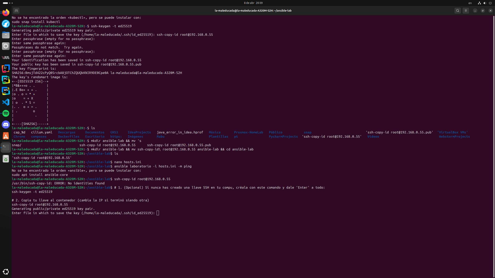
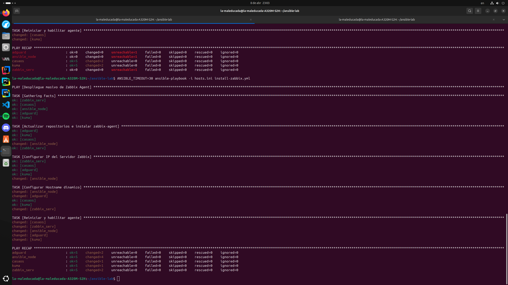
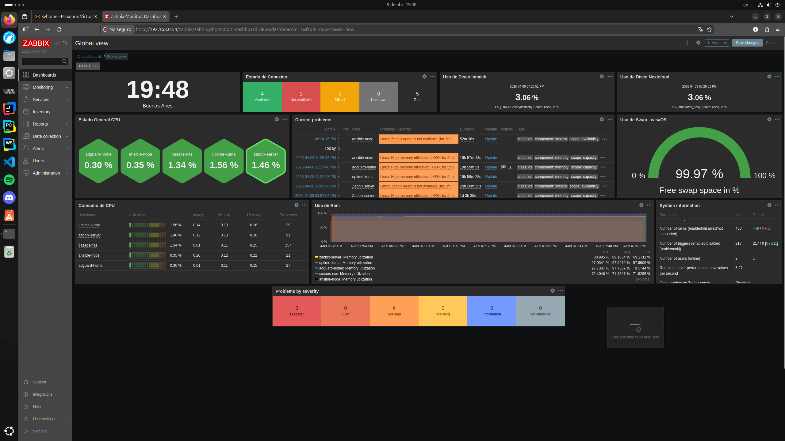

# 12-Ansible.md: Automatización y Monitoreo del Laboratorio

Este documento registra el proceso técnico completo, de principio a fin, para la creación de un nodo de control con Ansible, la configuración de seguridad, la resolución de todos los inconvenientes de infraestructura y el despliegue del monitoreo centralizado en Zabbix 7.0.

## 1. Creación del Nodo de Control (Ansible LXC)
Para centralizar la gestión, creamos un contenedor LXC dedicado ejecutando comandos directamente en la shell del hipervisor Proxmox (`svhome`).

### Creación del contenedor vía CLI
Ejecutamos el comando `pct create` para provisionar el contenedor asignando sus recursos, red y sistema operativo en una sola línea:

```bash
pct create 105 local:vztmpl/debian-12-standard_12.0-1_amd64.tar.zst \
  --hostname ansible-node \
  --cores 2 \
  --memory 1024 \
  --swap 512 \
  --net0 name=eth0,bridge=vmbr0,ip=192.168.0.55/24,gw=192.168.0.1 \
  --storage local-lvm \
  --unprivileged 1 \
  --features nesting=1 \
  --ostype debian
```

### Arranque e instalación de Ansible
Iniciamos el contenedor, ingresamos a su consola e instalamos el motor de Ansible:

```bash
pct start 105
pct enter 105
apt update && apt upgrade -y
apt install ansible -y
```

## 2. Configuración de Seguridad y Llaves SSH
Para permitir que Ansible gestione los nodos de forma automatizada sin pedir contraseña, establecimos una relación de confianza mediante llaves SSH.

### Generación de llaves
Dentro del nodo `ansible-node`, generamos la llave RSA:

```bash
ssh-keygen -t rsa -b 4096
```



### Distribución de la llave pública
Copiamos la llave a cada uno de los servidores del laboratorio:

```bash
ssh-copy-id root@192.168.0.51  # casaos
ssh-copy-id root@192.168.0.52  # adguard
ssh-copy-id root@192.168.0.53  # kuma
ssh-copy-id root@192.168.0.54  # zabbix_serv
```

## 3. Inventario del Laboratorio (`hosts.ini`)
Creamos el archivo de inventario con nano (`nano hosts.ini`) para organizar los nodos bajo el grupo `[Laboratorio]`, especificando las IPs y el usuario root.

```ini
[Laboratorio]
casaos        ansible_host=192.168.0.51 ansible_user=root
adguard       ansible_host=192.168.0.52 ansible_user=root
kuma          ansible_host=192.168.0.53 ansible_user=root
zabbix_serv   ansible_host=192.168.0.54 ansible_user=root
ansible_node  ansible_host=192.168.0.55 ansible_user=root
```

**Validamos la conectividad masiva:**

```bash
ansible Laboratorio -i hosts.ini -m ping
```

## 4. Troubleshooting y Resolución de Problemas Críticos
Durante el despliegue tuvimos que resolver tres bloqueos importantes en la infraestructura.

### A. Fallo en la Base de Datos de Zabbix
* **Problema:** Zabbix mostraba el error *"Zabbix server is not running: the information displayed may not be current"*.
* **Solución:** Ingresamos al contenedor de Zabbix y reiniciamos los servicios en orden de dependencia.
```bash
ssh root@192.168.0.54
systemctl restart mariadb
systemctl restart zabbix-server
exit
```

### B. Falta de métricas de CPU/RAM en LXC (Nesting)
* **Problema:** Los agentes instalados reportaban errores al leer hardware (`Zabbix agent is not available` o uso de memoria no detectado).
* **Solución:** Habilitamos el **Nesting** (Anidamiento) en Proxmox para permitir a los contenedores acceder a los sensores virtuales.
```bash
pct stop <ID_LXC>
pct set <ID_LXC> -features nesting=1
pct start <ID_LXC>
```

### C. Error 401 en Repositorios de Proxmox
* **Problema:** Al intentar instalar paquetes en el host físico (`svhome`) arrojaba `401 Unauthorized`.
* **Solución:** Deshabilitamos el repositorio Enterprise (de pago) y activamos el repositorio No-Subscription.
```bash
sed -i 's/^deb/#deb/g' /etc/apt/sources.list.d/pve-enterprise.list
echo "deb [http://download.proxmox.com/debian/pve](http://download.proxmox.com/debian/pve) trixie pve-no-subscription" > /etc/apt/sources.list.d/pve-install-repo.list
apt update
```

## 5. Despliegue Automatizado con Ansible
Con los problemas resueltos, utilizamos Ansible para instalar y configurar el agente de Zabbix en todos los nodos simultáneamente.

### Instalación del Agente Zabbix
```bash
ansible Laboratorio -i hosts.ini -m apt -a "name=zabbix-agent state=present update_cache=yes" --become
```

### Inyección de la IP del Servidor Zabbix
Modificamos el archivo de configuración para apuntar a la IP de nuestro Zabbix Server (`192.168.0.54`):
```bash
ansible Laboratorio -i hosts.ini -m lineinfile -a "path=/etc/zabbix/zabbix_agentd.conf regexp='^Server=' line='Server=192.168.0.54'" --become
```

### Reinicio y persistencia del servicio
```bash
ansible Laboratorio -i hosts.ini -m service -a "name=zabbix-agent state=restarted enabled=yes" --become
```




## 6. Configuración de Sensores Físicos (Mini PC i3-12100)
Para monitorear la temperatura real del hardware, instalamos `lm-sensors` directamente en el host físico Proxmox (`svhome`).

```bash
apt install lm-sensors -y
sensors-detect --auto
```

Cargamos los módulos detectados y los hicimos persistentes:
```bash
modprobe coretemp
modprobe nct6775
echo "coretemp" >> /etc/modules
echo "nct6775" >> /etc/modules
```

## 7. Configuración del Dashboard en Zabbix 7.0
Finalmente, organizamos la recolección de datos en un Dashboard centralizado con nivel NOC (Network Operations Center):

* **Fila Superior:** Reloj, Estado de Conexión (Host Availability) y *Item Values* para monitorear el uso de disco de contenedores clave (Nextcloud e Immich).
* **Columna Izquierda:** Widget **Honeycomb** (Panal de abejas) para visualizar gráficamente el estado general de CPU, seguido de la tabla de Consumo de CPU.
* **Centro:** Panel de **Current Problems** para tener un registro de alertas visuales inmediatas.
* **Derecha:** Widgets **Gauge** (Velocímetro) para el control visual del uso de *Swap* y la *Temperatura* del servidor físico.
* **Fila Inferior:** Gráfico de **Uso de RAM** estirado al 100% del ancho del dashboard para analizar el comportamiento histórico.

  

